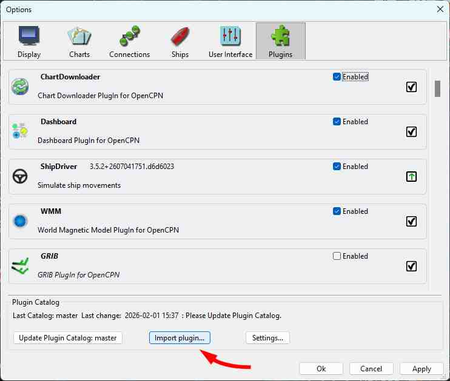
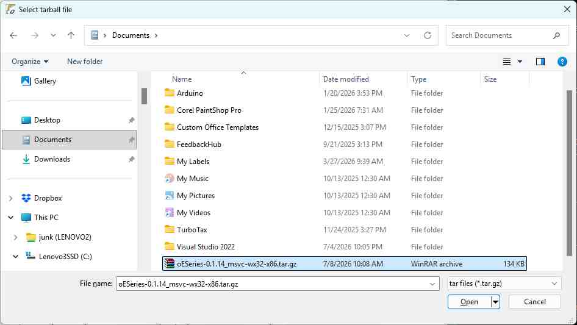
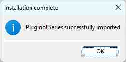
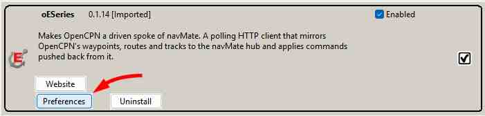
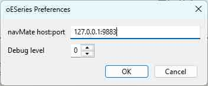
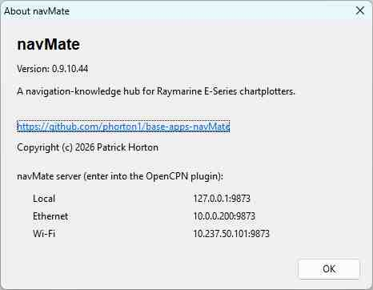

# oESeries - Getting Started

**[Home](readme.md)** --
**Getting Started** --
**[Design](design.md)** --
**[Protocol](protocol.md)** --
**[Implementation](implementation.md)** --
**[Build](build.md)** --
**[Releases](releases.md)**

**oESeries is a spoke of [navMate](https://github.com/phorton1/base-apps-navMate) -- it does
nothing on its own.** It makes OpenCPN a driven spoke of navMate: it mirrors OpenCPN's waypoints,
routes, and tracks to navMate and applies changes navMate pushes back. If you are not running
navMate, this plugin has nothing to talk to.

This page installs and configures the released plugin. To build it from source instead, see
[Build](build.md).

## Prerequisites

- **OpenCPN 5.12 or later, on Windows** (the standard 32-bit build; plugin API 1.20).
- **A running navMate hub** to sync with.

## Install

1. Download the latest **`oESeries-X.Y.NNN_msvc-wx32-x86.tar.gz`** from the
   [Releases page](https://github.com/phorton1/src-OpenCPN-oESeries/releases) (or from the
   [`releases/`](../releases/) folder in the repo).
2. In OpenCPN, open **Options -> Plugins**. This is the plugin manager; the **Import plugin...**
   button is at the bottom.

   

3. Click **Import plugin...** and pick the tarball you downloaded.

   

   OpenCPN imports the plugin, which then appears in the list.

   

4. Find **oESeries** in the plugin list and **Enable** it.

   

## Configure

1. In OpenCPN: **Options -> Plugins -> oESeries -> Preferences** (the settings/gear button).

   

2. Set **navMate host:port** to the address you read from navMate's **Help -> About navMate** dialog
   (see **Finding your navMate address** below). Running OpenCPN on the *same* PC as navMate is the
   common case: use the **Local** row, `127.0.0.1:<port>`.
3. Optionally set the **Debug level** (0 = quiet; higher = more detail in the plugin log).

### Finding your navMate address

Don't guess or hardcode the address -- read it from navMate's **Help -> About navMate** dialog, which
lists every address navMate is serving on, each labeled by interface, for example:

- **Local:** `127.0.0.1:9873` -- OpenCPN and navMate on the *same* computer.
- **Ethernet:** `10.0.0.200:9873` -- OpenCPN reaches navMate over a wired / boat LAN.
- **Wi-Fi:** `10.237.50.101:9873` -- OpenCPN reaches navMate over Wi-Fi.

Two rules when you copy a row:

- **Use the port the dialog shows.** Packaged navMate serves on **9873**; a development build uses
  9883, and a navMate preference can override the port. It is whatever the About dialog shows, not a
  fixed number.
- **Use the numeric IPv4 address -- never the word `localhost`.** navMate's server is IPv4-only, and
  `localhost` can resolve to the IPv6 address `::1` and fail to connect. For the same-machine case use
  `127.0.0.1` (the **Local** row).

Pick the row for the network this computer shares with navMate, and enter that exact **`ip:port`** in
the plugin's **navMate host:port** field.

## Verify it works

- The plugin list shows oESeries at version **`X.Y.NNN`** -- this should match the release you
  downloaded (the build number is part of the version, so you can confirm exactly what is installed).
- Create a waypoint in OpenCPN: it appears in navMate within a couple of seconds. Push one from
  navMate: it appears on the OpenCPN chart. Routes and tracks sync the same way, both directions.

## Troubleshooting

- **The plugin doesn't appear after import.** Confirm it is the Windows build and your OpenCPN is
  5.12+. Re-open **Options -> Plugins** (a fresh scan), and Enable it if it is listed but disabled.
- **It won't connect to navMate.** Work through these in order:
    1. **Re-check the ip:port.** Compare what you entered against navMate's **Help -> About navMate**
       dialog (see [Finding your navMate address](#finding-your-navmate-address)) -- the wrong address
       for your network is the most common cause -- and confirm navMate is actually running. If
       OpenCPN and navMate are on the **same PC**, this is all you need.
    2. **On a different computer, suspect the navMate PC's firewall.** navMate's installer allows the
       connection from any machine on the **same local network**, so a same-network OpenCPN normally
       connects on its own. If it doesn't, the usual cause is that Windows has classified the navMate
       PC's network as **Public** rather than **Private** -- Windows is stricter about local
       connections on Public networks. On the navMate PC, set that network to **Private** (Windows
       Settings -> Network & internet -> your connection -> Network profile type), and confirm
       **navMate** is allowed in **Windows Defender Firewall**. (If the two computers are on
       *different* networks rather than the same LAN, they will not connect this way at all.)
    3. **Still stuck?** Raise the plugin's log detail and see what it reports -- next item.
- **See what it is doing.** The plugin writes its own `oESeries.log` in OpenCPN's private data
  directory; raise the **Debug level** (in Preferences) to watch the sync loop and spot where a
  connection is failing.

## Please also see

[**navMate**](https://github.com/phorton1/base-apps-navMate) -- the boat-navigation hub oESeries is
a spoke of, and the place to learn what the sync is for.

**Next:** The [**Design Overview**](design.md), or the [**Releases**](releases.md) log.
